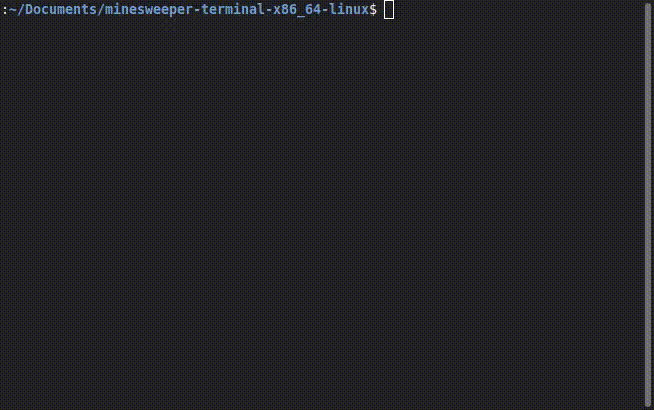

A cross-compatible recreation of MineSweeper programmed in C++.

It's compatible with MacOS, Linux, and Windows 10.

== I started this a couple months ago to improve my programming skills as a general novice to C++. After forgetting about it for a while, I finally decided to complete it. ==
